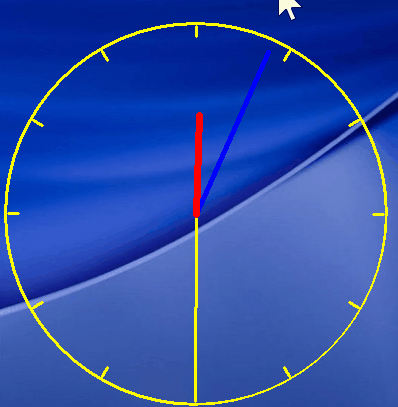

🕰️ Transparent Analog Clock
Windows 레거시 API로 만든 투명 배경의 아날로그 시계입니다.

🧾 Description
"Analog Clock"은 배경이 완전히 투명한 시계이며 [F1 - F4]와 방향키를 이용하여 위치 및 크기를 조정할 수 있습니다.
시스템 트레이는 지원하지 않으며 외에 시스템과 관련된 어떠한 기능도 지원하지 않습니다. 시계는 항상 최상위에 떠 있으며, 작업에 방해가 되지 않도록 마우스를 인식하지 않게 설계되었습니다.

✅ Dependencies
- Windows 98/2000 이상
- 관리자 권한 필요 없음

📦 Installing
- 프로그램 소스 코드만 제공하며 직접 빌드하여야 합니다.

▶️ Executing program
- None

❓ Help
- 시계 크기 변경시 : [F1 - F4] 키를 이용해 다시 한 번 위치를 조정해야 합니다.
- 다중 모니터 환경을 인식하지 못하는 경우 : 프로그램을 다시 한 번 실행해주세요.
- 다중 모니터 환경에서 위치를 변경하고 싶은 경우 : [Ctrl] 키와 [0] 숫자 키를 이용해 다음 모니터로 시계를 이동시킬 수 있습니다. 
- 프로그램 종료 방법 : 해당 프로그램은 마우스를 인식하지 못합니다. [Alt] + [Tab] 키를 이용하여 프로그램을 활성한 후 esc 키를 입력하여야 종료 메세지가 발생합니다.

👤 Authors
- stdsic — @https://github.com/stdsic/AnalogClock
